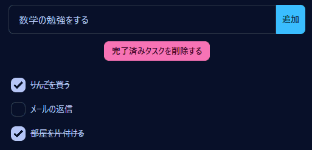

<h1 align="center">✅ ToDoリスト (Vue + TDD)</h1>

    

    
    
    

## 💬 概要

ToDoの管理ができます。
Vueとテスト駆動開発（TDD）の勉強のために作成しました。

## ▶️ ローカル実行

1.  `pnpm install`
2.  `pnpm dev`

*   テストの実行: `test:run`
*   テストカバレッジの取得: `test:coverage`

## 🔧 使用技術

*   [Vue.js 3](https://ja.vuejs.org/)
*   Test
    *   [Vitest](https://vitest.dev/)
    *   [Testing Library](https://testing-library.com/)
*   Style
    *   [Tailwind CSS](https://tailwindcss.com/)
    *   [daisyUI](https://daisyui.com/)
*   Linter / Formater
    *   [xo](https://github.com/xojs/xo)
    *   [Prettier](https://prettier.io/)
*   [GitHub Actions](https://docs.github.com/ja/actions)
